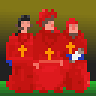
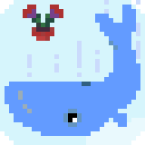
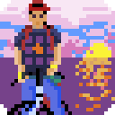

Howdy! Name's Alex!

Amongst my interests are such elements as 

 - 💻 computer-aided learning,
 - 🎲 game development and
 - 🛡️ computer security.

If you like my work feel free to give me a tip at [ko-fi.com/kraasch](https://ko-fi.com/kraasch) ☕.

So long!

<!--

-->

Here my [project overview](./info/overview.md).

Here my [stats](https://github-profile-summary-cards.vercel.app/demo.html):

